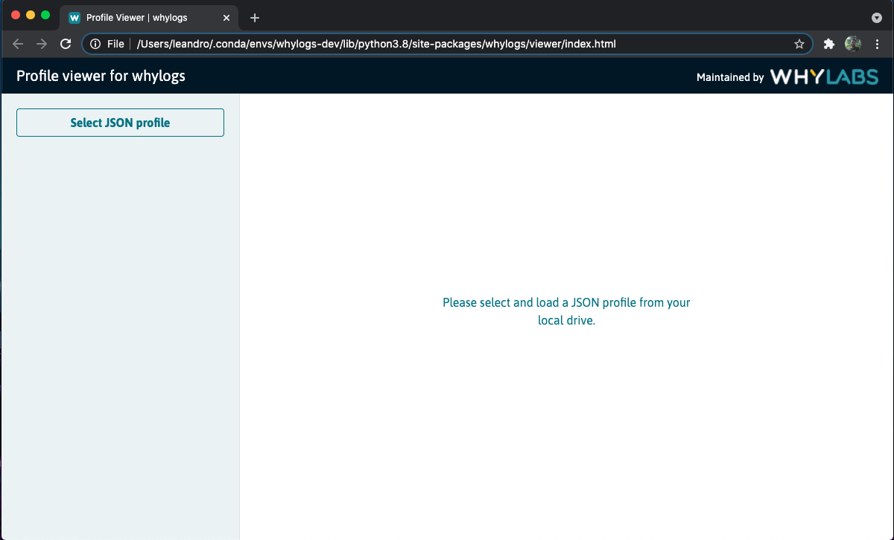
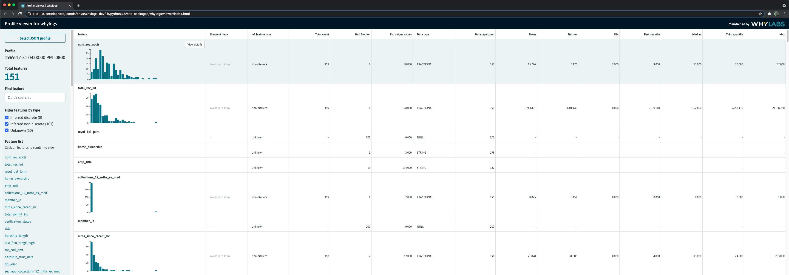

# whylogs: A Data and Machine Learning Logging Standard


[](https://github.com/whylabs/whylogs-python/blob/mainline/LICENSE)
[](https://badge.fury.io/py/whylogs)
[](https://coveralls.io/github/whylabs/whylogs-python?branch=mainline)
[](https://github.com/python/black)
[](https://bestpractices.coreinfrastructure.org/projects/4490)
[](https://pepy.tech/project/whylogs)

[](https://codeclimate.com/github/whylabs/whylogs-python/maintainability)


whylogs is an open source standard for data and ML logging

whylogs logging agent is the easiest way to enable logging, testing, and monitoring in an ML/AI application. The lightweight agent profiles data in real time, collecting thousands of metrics from structured data, unstructured data, and ML model predictions with zero configuration. 

whylogs can be installed in any Python, Java or Spark environment; it can be deployed as a container and run as a sidecar; or invoked through various ML tools (see integrations). 

whylogs is designed by data scientists, ML engineers and distributed systems engineers to log data in the most cost-effective, scalable and accurate manner. No sampling. No post-processing. No manual configurations.

whylogs is released under the Apache 2.0 open source license. It supports many languages and is easy to extend. This repo contains the whylogs CLI, language SDKs, and individual libraries are in their own repos.

This is a Python implementation of whylogs. The Java implementation can be found [here](https://github.com/whylabs/whylogs-java).

If you have any questions, comments, or just want to hang out with us, please join [our Slack channel](http://join.slack.whylabs.ai/).


- [Getting started](#getting-started)
- [Features](#features)
- [Data Types](#data-types)
- [Integrations](#integrations)
- [Examples](#examples)
- [Community](#community)
- [Roadmap](#roadmap)
- [Contribute](#contribute)


## Getting started<a name="getting-started" />


### Using pip

Install whylogs using the pip package manager by running

```
pip install whylogs
```

### From the source 

- Download the source code by cloning the repository or by pressing [Download ZIP](https://github.com/whylabs/whylogs-python/archive/master.zip) on this page. 

- You'll need to install poetry in order to install dependencies using the lock file in this project. Follow [their docs](https://python-poetry.org/docs/) to get it set up.

- Run the following comand at the root of the source code:

```
make install
make
```


## Quickly Logging Data

whylogs is easy to get up and runnings

```python
from whylogs import get_or_create_session
import pandas as pd

session = get_or_create_session()

df = pd.read_csv("path/to/file.csv")

with session.logger(dataset_name="my_dataset") as logger:
    
    #dataframe
    logger.log_dataframe(df)

    #dict
    logger.log({"name": 1})

    #images
    logger.log_images("path/to/image.png")
```

To view your logger profiles you can use, methods within `whylogs.viz` or open a profile viewer using the following command

```python
test_profile = logger.profile()

vizualization = ProfileVisualizer()
vizualization.set_profiles([test_profile])
figure= my_ viz.plot_distribution("<feature_name>")
figure.savefig("/my/image/path.png")
```

You can also load a local html viewer, where you upload the `json` summary file. The default path for the json files is located at `output/{dataset_name}/{session_id}/json/dataset_profile.json`. 

```python
from whylogs.viz import profile_viewer
profile_viewer()
```
This will load the profile viewer loader, using the `Select JSON profile`


Once the json is selected you can view your profile feature name and statistics.




This will open a viewer on your default browser where you can load a profile json summary

whyLogs collects approximate statistics and sketches of data on a column-basis into a statistical profile. These metrics include:

- Simple counters: boolean, null values, data types.
- Summary statistics: sum, min, max, variance.
- Unique value counter or cardinality: tracks an approximate unique value of your feature using HyperLogLog algorithm.
- Histograms for numerical features. whyLogs binary output can be queried to with dynamic binning based on the shape of your data.
- Top frequent items (default is 128). Note that this configuration affects the memory footprint, especially for text features.

Check the examples below for visualization and other use cases


## Documentation 

The [documentation](https://docs.whylabs.ai/docs/) of this package is generated automatically. 


## Features

- Accurate data profiling: whylogs calculates statistics from 100% of the data, never requiring sampling, ensuring an accurate representation of data distributions
- Lightweight runtime: whylogs utilizes approximate statistical methods to achieve minimal memory footprint that scales with the number of features in the data
- Any architecture: whylogs scales with your system, from local development mode to live production systems in multi-node clusters, and works well with batch and streaming architectures
- Configuration-free: whylogs infers the schema of the data, requiring zero manual configuration to get started
- Tiny storage footprint: whylogs turns data batches and streams into statistical fingerprints, 10-100MB uncompressed
- Unlimited metrics: whylogs collects all possible statistical metrics about structured or unstructured data


## Data Types<a name="data-types" />
Whylogs supports both structured and unstructured data, specifically: 

| Data type  | Features | Notebook Example |
| --- | --- | ---|
|Structured Data | Distribution, cardinality, schema, counts, missing values | [Getting started with structured data](https://github.com/whylabs/whylogs-examples/blob/mainline/python/GettingStarted.ipynb) | 
| Images | exif metadata, derived pixels features,  bounding boxes | [Getting started with images](https://github.com/whylabs/whylogs-examples/blob/mainline/python/Logging_Images.ipynb) |
| Video  | In development  | [Github Issue #214](https://github.com/whylabs/whylogs/issues/214) |
| Tensors | derived 1d features (more in developement) | [Github Issue #216](https://github.com/whylabs/whylogs/issues/216) |
| Text | top k values, counts, cardinality (more in developement) | [Github Issue #213](https://github.com/whylabs/whylogs/issues/213) |
| Audio | In developement | [Github Issue #212](https://github.com/whylabs/whylogs/issues/212) | 


## Integrations


| Integration | Features | Resources |
| --- | --- | ---  | 
| Spark | Run whylogs in Apache Spark environment|  <ul><li>[Code Example](https://github.com/whylabs/whylogs-examples/blob/mainline/scala/src/main/scala/WhyLogsDemo.scala)</li></ul> | 
| Pandas | Log and monitor any pandas dataframe |  <ul><li>[Notebook Example](https://github.com/whylabs/whylogs-examples/blob/mainline/python/logging_example.ipynb)</li><li>[whylogs: Embrace Data Logging](https://whylabs.ai/blog/posts/whylogs-embrace-data-logging)</li></ul>  |
| Kafka | Log and monitor Kafka topics with whylogs| <ul><li>[Notebook Example](https://github.com/whylabs/whylogs-examples/blob/mainline/python/Kafka.ipynb)</li><li> [Integrating whylogs into your Kafka ML Pipeline](https://whylabs.ai/blog/posts/integrating-whylogs-into-your-kafka-ml-pipeline) </li></ul>|
| MLflow | Enhance MLflow metrics with whylogs:  | <ul><li>[Notebook Example](https://github.com/whylabs/whylogs-examples/blob/mainline/python/MLFlow%20Integration%20Example.ipynb)</li><li>[Streamlining data monitoring with whylogs and MLflow](https://whylabs.ai/blog/posts/on-model-lifecycle-and-monitoring)</li></ul> |
| Github actions | Unit test data with whylogs and github actions| <ul><li>[Notebook Example](https://github.com/whylabs/whylogs-examples/tree/mainline/github-actions)</li></ul> |
| RAPIDS |  Use whylogs in RAPIDS environment | <ul><li>[Notebook Example](https://github.com/whylabs/whylogs-examples/blob/mainline/python/RAPIDS%20GPU%20Integration%20Example.ipynb)</li><li>[Monitoring High-Performance Machine Learning Models with RAPIDS and whylogs](https://whylabs.ai/blog/posts/monitoring-high-performance-machine-learning-models-with-rapids-and-whylogs)</li></ul> |
| Java | Run whylogs in Java environment| <ul><li>[Notebook Example](https://github.com/whylabs/whylogs-examples/blob/mainline/java/demo1/src/main/java/com/whylogs/examples/WhyLogsDemo.java)</li></ul>  |
| Docker | Run whylogs as in Docker |  <ul><li>[Rest Container](https://docs.whylabs.ai/docs/integrations-rest-container)</li></ul>| 
| AWS S3 |  Store whylogs profiles in S3 | <ul><li>[S3 example](https://github.com/whylabs/whylogs-examples/blob/mainline/python/S3%20example.ipynb)</li></ul>


## Examples
For a full set of our examples, please check out [whylogs-examples](https://github.com/whylabs/whylogs-examples).

Check out our example notebooks with Binder: [](https://mybinder.org/v2/gh/whylabs/whylogs-examples/HEAD)
- [Getting Started notebook](https://github.com/whylabs/whylogs-examples/blob/mainline/python/GettingStarted.ipynb)
- [Logging Example notebook](https://github.com/whylabs/whylogs-examples/blob/mainline/python/logging_example.ipynb)
- [Logging Images](https://github.com/whylabs/whylogs-examples/blob/mainline/python/Logging_Images.ipynb)
- [MLflow Integration](https://github.com/whylabs/whylogs-examples/blob/mainline/python/MLFlow%20Integration%20Example.ipynb)


## Roadmap

whylogs is maintained by [WhyLabs](https://whylabs.ai).


## Community

If you have any questions, comments, or just want to hang out with us, please join [our Slack channel](http://join.slack.whylabs.ai/).


## Contribute

We welcome contributions to whylogs. Please see our [contribution guide](https://github.com/whylabs/whylogs/blob/mainline/CONTRIBUTING.md) and our [developement guide](https://github.com/whylabs/whylogs/blob/mainline/DEVELOPMENT.md) for details.
