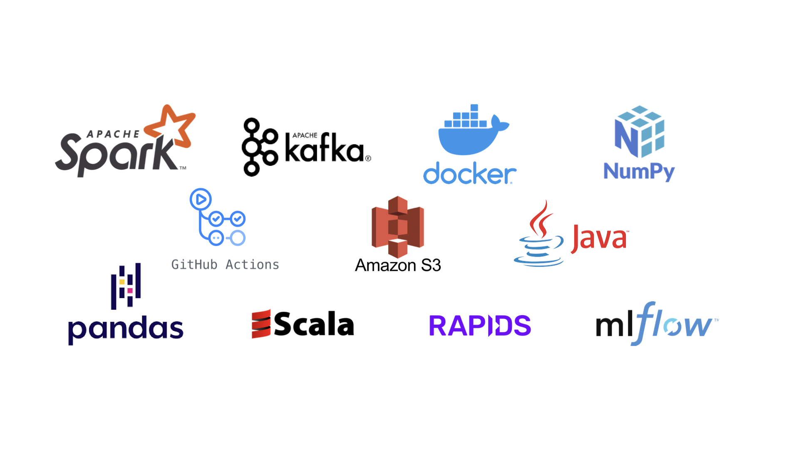

<p align="center">
    
    </br>
    <h1 align="center">The open source standard for data logging
 </h1>
  <h3 align="center">
   <a href="https://docs.whylabs.ai/docs/"><b>Documentation</b></a> &bull;
   <a href="https://bit.ly/whylogsslack"><b>Slack Community</b></a> &bull;
   <a href="https://github.com/whylabs/whylogs#python-quickstart"><b>Python Quickstart</b></a>
 </h3>

<p align="center">
<a href="https://github.com/whylabs/whylogs-python/blob/mainline/LICENSE" target="_blank">
    
</a>
<a href="https://badge.fury.io/py/whylogs" target="_blank">
    
</a>
<a href="https://github.com/python/black" target="_blank">
    
</a>
<a href="https://bestpractices.coreinfrastructure.org/projects/4490" target="_blank">
    
</a>
<a href="https://pepy.tech/project/whylogs" target="_blank">
    
</a>
<a href="bit.ly/whylogs" target="_blank">
    
</a>
<a href="https://codeclimate.com/github/whylabs/whylogs-python/maintainability" target="_blank">
    
</a>
</p>

## What is whylogs

whylogs is an open source library for logging any kind of data. With whylogs, users are able to generate summaries of their datasets (called *whylogs profiles*) which they can use to:
1. Track changes in their dataset
2. Create *data constraints* to know whether their data looks they way it should
3. Quickly visualize key summary statistics about their datasets

These three functionalities enable a variety of use cases for data scientists, machine learning engineers, and data engineers:
* Detecting data drift (and resultant ML model performance degradation)
* Data quality validation
* Exploratory data analysis via data profiling
* Tracking data for ML experiments
* And many more

whylogs can be run in Python or [Apache Spark](https://docs.whylabs.ai/docs/spark-integration) (both PySpark and Scala) environments on a variety of [data types](#data-types). We [integrate](#integrations) with lots of other tools including Pandas, [AWS Sagemaker](https://aws.amazon.com/blogs/startups/preventing-amazon-sagemaker-model-degradation-with-whylabs/), [MLflow](https://docs.whylabs.ai/docs/mlflow-integration), [Flask](https://whylabs.ai/blog/posts/deploy-and-monitor-your-ml-application-with-flask-and-whylabs), [Ray](https://docs.whylabs.ai/docs/ray-integration), [RAPIDS](https://whylabs.ai/blog/posts/monitoring-high-performance-machine-learning-models-with-rapids-and-whylogs), [Apache Kafka](https://docs.whylabs.ai/docs/kafka-integration), and more.

If you have any questions, comments, or just want to hang out with us, please join [our Slack Community](http://join.slack.whylabs.ai/). In addition to joining the Slack Community, you can also help this project by giving us a ⭐ in the upper right corner of this page.


## Python Quickstart<a name="python-quickstart" />


### Install whylogs

Install whylogs using the pip package manager by running:

```
pip install whylogs
```

### Log some data

Profiling dataframes, Python dicts, or images is as easy as running:

```python
from whylogs import get_or_create_session
import pandas as pd

session = get_or_create_session()

with session.logger(dataset_name="my_dataset") as logger:
    logger.log_dataframe(df)
```

## Table of Contents

- [whylogs Profiles](#whylogs-profiles)
- [Visualizing Profiles](#visualizing-profiles)
- [Features](#features)
- [Data Types](#data-types)
- [Integrations](#integrations)
- [Examples](#examples)
- [Community](#community)
- [Roadmap](#roadmap)
- [Contribute](#contribute)

## whylogs Profiles<a name="whylogs-profiles" />

### What are profiles

whylogs profiles are the core of the whylogs library. They capture key statistical properties of data, such as the distribution (far beyond simple mean, median, and standard deviation measures), the number of missing values, and a wide range of configurable custom metrics. By capturing these summary statistics, we are able to accurately represent the data and enable all of the use cases described in the introduction.

whylogs profiles have three properties that make them ideal for data logging: they are **descriptive**, **lightweight**, and **mergeable**.

<br />


**Descriptive**: whylogs profiles describe the dataset that they represent. This high fidelity representation of datasets is what enables whylogs profiles to be effective snapshots of the data. They are better at capturing the characteristics of a dataset than a sample would be, as discussed in our [Data Logging: Sampling versus Profiling](https://whylabs.ai/blog/posts/data-logging-sampling-versus-profiling) blog post. 

<br />


**Lightweight**: In addition to being a high fidelity representation of data, whylogs profiles also have high information density. You can easily profile terabytes or even petabytes of data in profiles that are only megabytes large. Because whylogs profiles are lightweight, they are very inexpensive to store, transport, and interact with.

<br />


**Mergeable**: One of the most powerful features of whylogs profiles is their mergeability. Mergeability means that whylogs profiles can be combined together to form new profiles which represent the aggregate of their constituent profiles. This enables logging for distributed and streaming systems, and allows users to view aggregated data across any time granularity.

### How do you generate profiles

Once whylogs is installed, it's easy to generate profiles in both Python and Java environments.

To generate a profile from a Pandas dataframe in Python, simply run:
```python
from whylogs import get_or_create_session
import pandas as pd

session = get_or_create_session()

df = pd.read_csv("path/to/file.csv")

with session.logger(dataset_name="my_dataset") as logger:
    logger.log_dataframe(df)
```

For images, replace `logger.log_dataframe(df)` with `logger.log_image("path/to/image.png")`. Similarly, you can profile Python dicts by running `logger.log(dict)` directly on the dict object.

### What can you do with profiles

Once you’ve generated whylogs profiles, a few things can be done with them:

In your local Python environment, you can set data constraints or visualize your profiles. Setting data constraints on your profiles allows you to get notified when your data don’t match your expectations, allowing you to do data unit testing and some baseline data monitoring. With the Profile Visualizer, you can visually explore your data, allowing you to understand it and ensure that your ML models are ready for production.

In addition, you can send whylogs profiles to the SaaS ML monitoring and AI observability platform [WhyLabs](whylabs.ai). With WhyLabs, you can automatically set up monitoring for your machine learning models, getting notified on both data quality and data change issues (such as data drift). If you’re interested in trying out WhyLabs, check out the always free [Starter edition](whylabs.ai/free), which allows you to experience the entire platform’s capabilities with no credit card required.


## Visualizing Profiles<a name="visualizing-profiles" />

### Multiple profile plots

To view your logger profiles you can use, methods within `whylogs.viz`: 

```python
vizualization = ProfileVisualizer()
vizualization.set_profiles([profile_day_1, profile_day_2])
figure= vizualization.plot_distribution("<feature_name>")
figure.savefig("/my/image/path.png")
```

Individual profiles can be saved to local disk, uploaded to AWS S3, or sent to the WhyLabs AI Observability Platform via the WhyLabs API. This can be set up to happen automatically when loggers are closed, per the configuration found in the Session configuration.

Current profiles from active loggers can be loaded from memory with:
```python
profile = logger.profile()
```

### Profile viewer

You can also load a local profile viewer, where you upload the `json` summary file. The default path for the json files is set as `output/{dataset_name}/{session_id}/json/dataset_profile.json`.

```python
from whylogs.viz import profile_viewer
profile_viewer()
```

This will open a viewer on your default browser where you can load a profile json summary, using the `Select JSON profile` button:
Once the json is selected you can view your profile's features and associated statistics.


## Features


whylogs collects approximate statistics and sketches of data on a column-basis into a statistical profile. These metrics include:

- Simple counters: boolean, null values, data types.
- Summary statistics: sum, min, max, median, variance.
- Unique value counter or cardinality: tracks an approximate unique value of your feature using HyperLogLog algorithm.
- Histograms for numerical features. whyLogs binary output can be queried to with dynamic binning based on the shape of your data.
- Top frequent items (default is 128). Note that this configuration affects the memory footprint, especially for text features.

Some other key features about whylogs:

- Accurate data profiling: whylogs calculates statistics from 100% of the data, never requiring sampling, ensuring an accurate representation of data distributions
- Lightweight runtime: whylogs utilizes approximate statistical methods to achieve minimal memory footprint that scales with the number of features in the data
- Any architecture: whylogs scales with your system, from local development mode to live production systems in multi-node clusters, and works well with batch and streaming architectures
- Configuration-free: whylogs infers the schema of the data, requiring zero manual configuration to get started
- Tiny storage footprint: whylogs turns data batches and streams into statistical fingerprints, 10-100MB uncompressed
- Unlimited metrics: whylogs collects all possible statistical metrics about structured or unstructured data


## Data Types<a name="data-types" />
whylogs supports both structured and unstructured data, specifically: 

| Data type  | Features | Notebook Example |
| --- | --- | ---|
|Structured Data | Distribution, cardinality, schema, counts, missing values | [Getting started with structured data](https://github.com/whylabs/whylogs-examples/blob/mainline/python/GettingStarted.ipynb) | 
| Images | exif metadata, derived pixels features,  bounding boxes | [Getting started with images](https://github.com/whylabs/whylogs-examples/blob/mainline/python/Logging_Images.ipynb) |
| Video  | In development  | [Github Issue #214](https://github.com/whylabs/whylogs/issues/214) |
| Tensors | derived 1d features (more in developement) | [Github Issue #216](https://github.com/whylabs/whylogs/issues/216) |
| Text | top k values, counts, cardinality | [String Features](https://github.com/whylabs/whylogs/blob/mainline/examples/String_Features.ipynb) |
| Audio | In developement | [Github Issue #212](https://github.com/whylabs/whylogs/issues/212) | 


## Integrations


| Integration | Features | Resources |
| --- | --- | ---  | 
| Spark | Run whylogs in Apache Spark environment|  <ul><li>[Code Example](https://github.com/whylabs/whylogs-examples/blob/mainline/scala/src/main/scala/WhyLogsDemo.scala)</li></ul> | 
| Pandas | Log and monitor any pandas dataframe |  <ul><li>[Notebook Example](https://github.com/whylabs/whylogs-examples/blob/mainline/python/logging_example.ipynb)</li><li>[whylogs: Embrace Data Logging](https://whylabs.ai/blog/posts/whylogs-embrace-data-logging)</li></ul>  |
| Kafka | Log and monitor Kafka topics with whylogs| <ul><li>[Notebook Example](https://github.com/whylabs/whylogs-examples/blob/mainline/python/Kafka.ipynb)</li><li> [Integrating whylogs into your Kafka ML Pipeline](https://whylabs.ai/blog/posts/integrating-whylogs-into-your-kafka-ml-pipeline) </li></ul>|
| MLflow | Enhance MLflow metrics with whylogs:  | <ul><li>[Notebook Example](https://github.com/whylabs/whylogs-examples/blob/mainline/python/MLFlow%20Integration%20Example.ipynb)</li><li>[Streamlining data monitoring with whylogs and MLflow](https://whylabs.ai/blog/posts/on-model-lifecycle-and-monitoring)</li></ul> |
| Github actions | Unit test data with whylogs and github actions| <ul><li>[Notebook Example](https://github.com/whylabs/whylogs-examples/tree/mainline/github-actions)</li></ul> |
| RAPIDS |  Use whylogs in RAPIDS environment | <ul><li>[Notebook Example](https://github.com/whylabs/whylogs-examples/blob/mainline/python/RAPIDS%20GPU%20Integration%20Example.ipynb)</li><li>[Monitoring High-Performance Machine Learning Models with RAPIDS and whylogs](https://whylabs.ai/blog/posts/monitoring-high-performance-machine-learning-models-with-rapids-and-whylogs)</li></ul> |
| Java | Run whylogs in Java environment| <ul><li>[Notebook Example](https://github.com/whylabs/whylogs-examples/blob/mainline/java/demo1/src/main/java/com/whylogs/examples/WhyLogsDemo.java)</li></ul>  |
| Docker | Run whylogs as in Docker |  <ul><li>[Rest Container](https://docs.whylabs.ai/docs/integrations-rest-container)</li></ul>| 
| AWS S3 |  Store whylogs profiles in S3 | <ul><li>[S3 example](https://github.com/whylabs/whylogs-examples/blob/mainline/python/S3%20example.ipynb)</li></ul>

## Examples
For a full set of our examples, please check out the [examples folder](/examples/).

Check out our example notebooks with Binder: [](https://mybinder.org/v2/gh/whylabs/whylogs-examples/HEAD)
- [Getting Started notebook](https://github.com/whylabs/whylogs-examples/blob/mainline/python/GettingStarted.ipynb)
- [Logging Example notebook](https://github.com/whylabs/whylogs-examples/blob/mainline/python/logging_example.ipynb)
- [Logging Images](https://github.com/whylabs/whylogs-examples/blob/mainline/python/Logging_Images.ipynb)
- [MLflow Integration](https://github.com/whylabs/whylogs-examples/blob/mainline/python/MLFlow%20Integration%20Example.ipynb)


## Roadmap

whylogs is maintained by [WhyLabs](https://whylabs.ai).

## Community

If you have any questions, comments, or just want to hang out with us, please join [our Slack channel](http://join.slack.whylabs.ai/).

## Contribute

### How to Contribute
We welcome contributions to whylogs. Please see our [contribution guide](https://github.com/whylabs/whylogs/blob/mainline/CONTRIBUTING.md) and our [development guide](https://github.com/whylabs/whylogs/blob/mainline/DEVELOPMENT.md) for details.

### Contributors
<a href="https://github.com/whylabs/whylogs/graphs/contributors">
  
</a>

Made with [contrib.rocks](https://contrib.rocks).
