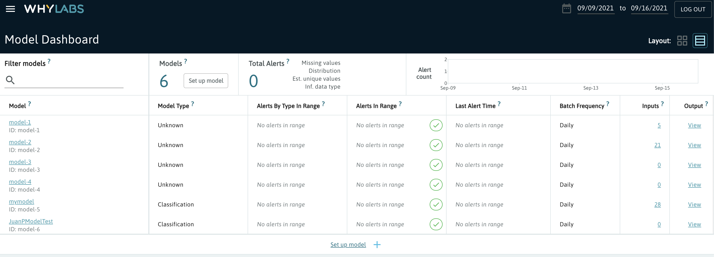

# Flask + WhyLabs Integration
This example runs a Flask application that serves a scikit-learn model which predicts a flower class given its features. 

This app is build with Flask with two endpoints:

- __/api/v1/health__: Returns a 200 status response if the API is up and running.
- __/api/v1/predict__: Returns a predicted class given an input feature vector.

The app is structured in different files and folders:

<details>

- [__api/__](api/): This folder contains view functions code for each endpoint.
  - [__utils.py__](api/utils.py): Utility functions for endpoints.
  - [__views.py__](api/views.py): Endpoints management.
- [__.env__](.env): Environment variables configuration file.
- [__.whylogs.yaml__](.whylogs.yaml): Whylogs session configuration file.
- [__app.py__](app.py): App module, containing the app factory function.
- [__extensions.py__](extensions.py): Swagger documentation utility functions.
- [__schemas.py__](schemas.py): Schemas used in the API.
- [__requirements.txt__](requirements.txt): App python packages needed by the application.
- [__swagger.yaml__](swagger.yaml): Swagger yaml documentation definition.
- [__settings.py__](settings.py): Environment variables setting.
- [__utils.py__](utils.py): Utility functions to handle responses.

These files contains code to download the [Iris Species Dataset](https://archive.ics.uci.edu/ml/datasets/iris) and train the model:

- [__train.py__](train.py)

</details>

The Flask application also takes care of writing the data when you kill the application with `^C`

<details>
<summary> Session management details</summary>

- In [__views.py__](https://github.com/whylabs/whylogs/blob/dev/loka/examples/examples/flask_sklearn_example/api/views.py#L10) you will notice we are using `initialize_logger()` which creates a logger instance, so every time that the app is running will have a new logger initialization.

</details>

## Requirements

- Conda or a python environment management tool (e.g. venv or pipenv)
- Docker

## Steps

### 1. Whylabs configuration

Adapt the .whylogs.yaml file. This file configures your output destiny using writers, the output format of your dataset profile, the name of your project, between others.

```yaml
project: example-project
pipeline: example-pipeline
verbose: false
writers:
- data_collection_consent: true
  formats: ['protobuf']
  output_path: whylabs
  type: whylabs
```

### 2. Environment variables management

To be able to use this application with your own WhyLabs account, you have to create an .env file, copy the following lines of code and fill _WHYLABS_API_KEY_ and _WHYLABS_DEFAULT_ORG_ID_ accordingly.

<details>
<summary>.env example</summary>

```bash
# This is an example of what .env file should looks like
# Flask
FLASK_ENV=development
FLASK_DEBUG=1
FLASK_APP=autoapp.py
MODEL_PATH=model.joblib

# Swagger Documentation
SWAGGER_HOST=0.0.0.0:5000
SWAGGER_BASEPATH=/api/v1
SWAGGER_SCHEMES={"http"}

# WhyLabs
WHYLABS_CONFIG=.whylogs.yaml
WHYLABS_API_KEY=...
WHYLABS_DEFAULT_ORG_ID=...
WHYLABS_DEFAULT_DATASET_ID=model-1
WHYLABS_API_ENDPOINT=https://api.whylabsapp.com

# Whylabs session
DATASET_NAME=this_is_my_dataset
ROTATION_TIME=1h
DATASET_URL=dataset/Iris.csv
```

</details>

### 3. Activate your environment

If you are using conda environments use the next command:

```bash
conda env create -f environment.yml
```

### 4. Train the model

__Train an SVM classifier__

1. Configure dependencies in an environment (e.g. can use conda).
2. Run `train.py`.

```bash
python train.py
```

### 5. Build a docker image

The whole API is being packaged using Docker. To build the docker image that contains all your app needs to run without problems, run the following command:

```bash
docker build --build-arg PYTHON_VERSION=3.7 -t whylabs-flask .
```

### 6. Starting the API

To start your server API run the following command:

```bash
docker run --rm -p 5000:5000 -v $(pwd):/app  whylabs-flask
```

API will be served on http://0.0.0.0:5000/.

## 7. Test the API

Swagger documentation is included so you can test your endpoints from Swagger UI easily. To open Swagger UI go to http://0.0.0.0:5000/apidocs once your docker container is running.


## 8. Watch your logs on WhyLabs platform

- Go to https://hub.whylabsapp.com/models



- Select your model (by default is model-1)


- Select the feature of interest and explore


## TL;DR

Create a conda environment using the [environment.yml](environment.yml) file and activate it then run [the example notebook](full_notebook.ipynb).