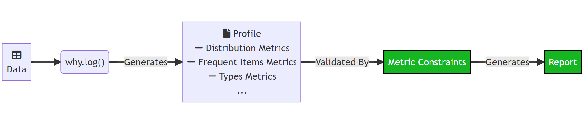

# Data Validation

Data validation is the process of ensuring that data is accurate, complete, and consistent. It involves checking data for errors or inconsistencies, and ensuring that it meets the specified requirements or constraints. Data validation is important because it helps to ensure the integrity and quality of data, and helps to prevent errors or inaccuracies in data from propagating and causing problems downstream.

In whylogs, you validate data by creating __Metric Constraints__ and validating those constraints against a whylogs profile.

## Metric Constraints

Constraints are a powerful feature built on top of whylogs profiles that enable you to quickly and easily validate that your data looks the way that it should. There are numerous types of constraints that you can set on your data (that numerical data will always fall within a certain range, that text data will always be in a JSON format, etc) and, if your dataset fails to satisfy a constraint, you can fail your unit tests or your CI/CD pipeline.

You can create Metric Constraints in two different ways:

- By directly using out-of-the-box helper constraints, such as _greater\_than\_number_, _no\_missing\_values_, or _is\_non\_negative_. You can see the full list of existing helper constraints, and how to use them, in the [Constraints Suite Notebook](https://nbviewer.org/github/whylabs/whylogs/blob/mainline/python/examples/basic/Constraints_Suite.ipynb)
- By assembling your own set of tailored constraints: You can see how to do this in the [Metric Constraints Notebook](https://nbviewer.org/github/whylabs/whylogs/blob/mainline/python/examples/advanced/Metric_Constraints.ipynb).


Once you have a set of constraints, you can use it to validate or generate a report of a Profile.

For example, let's suppose we create a set of constraints as below:

```python
import whylogs as why
from whylogs.core.constraints import ConstraintsBuilder
from whylogs.core.constraints.factories import (
    greater_than_number,
    null_values_below_number,
    column_is_nullable_fractional
)

profile_view = why.log(df).view()

builder = ConstraintsBuilder(dataset_profile_view=profile_view)
builder.add_constraint(greater_than_number(column_name="legs", number=2))
builder.add_constraint(null_values_below_number(column_name="animal", number=5))
builder.add_constraint(column_is_nullable_fractional(column_name="weight"))

constraints = builder.build()
```

### Validate
You can validate your profile by calling `constraints.validate()`, which will return __True__ if all of the constraints passed, and __False__ otherwise.

### Constraints Report
A second way to validate your profile is by calling `constraints.generate_constraints_report()`:

```python
constraints.generate_constraints_report()
```

```bash
[ReportResult(name='legs greater than number 2', passed=0, failed=1, summary=None),
 ReportResult(name='null values of animal lower than 5', passed=1, failed=0, summary=None),
 ReportResult(name='weight is nullable fractional', passed=1, failed=0, summary=None)]
```

The report will bring the result for each constraint in a list format.

### Visualization

The constraints report can also be displayed in a more human-friendly way by using the __NotebookProfileVisualizer__ integration:

```python
from whylogs.viz import NotebookProfileVisualizer

visualization = NotebookProfileVisualizer()
visualization.constraints_report(constraints, cell_height=300)
```


The report supports in-notebook visualization and it can also be downloaded in html format.

## Overview

As its name suggest, a metrics constraint uses metrics in a profile to perform the validation. With no additional customization, the constraint will have at its disposal standard metrics captured in the logging process, such as Distribution, Frequent Items and Cardinality metrics:



For example, the `legs greater than number 2` would use the metric component `min` of the `distribution` metric of the `legs` column to perform the validation.

### Customization

To enable additional use cases for Metric Constraints, you need to define additional metrics, which will then be used by the constraints. This can be done, for example, by:

- Creating custom metrics - See the [Custom Metrics Example](https://nbviewer.org/github/whylabs/whylogs/blob/mainline/python/examples/advanced/Custom_Metrics.ipynb)
- Creating Condition Count Metrics - See the [Condition Count Metrics](https://nbviewer.org/github/whylabs/whylogs/blob/mainline/python/examples/advanced/Condition_Count_Metrics.ipynb) and [Metric Constraints with Condition Count Metrics](https://nbviewer.org/github/whylabs/whylogs/blob/mainline/python/examples/advanced/Metric_Constraints_with_Condition_Count_Metrics.ipynb) examples
- Creating existing, but non-standard metrics for specific data types, such as [String Tracking](https://nbviewer.org/github/whylabs/whylogs/blob/mainline/python/examples/advanced/String_Tracking.ipynb) and [Image](https://nbviewer.org/github/whylabs/whylogs/blob/mainline/python/examples/advanced/Image_Logging.ipynb) metrics


Once the additional metric is added to the profile, you can use Metric Constraints the very same way as you would for standard metrics.

Of the examples above, the __Condition Count Metric__ has some particularities, so let's use it to explain some details.

## Condition Count Metrics

whylogs profiles contain summarized information about our data. This means that it's a __lossy__ process, and once we get the profiles, we don't have access anymore to the complete set of data.

This makes some types of constraints impossible to be created from standard metrics itself. For example, suppose you need to check every row of a column to check that there is no textual information that matches a credit card number or email information. Or maybe you're interested in ensuring that there are no even numbers in a certain column. How do we do that if we don't have access to the complete data?

The answer is that you need to define a __Condition Count Metric__ to be tracked __before__ logging your data. This metric will count the number of times the values of a given column meet a user-defined condition. When the profile is generated, you'll have that information to check against the constraints you'll create.

### Actions

Additionally, with condition count metrics you can define actions that will be triggered whenever the specified conditions are met during the logging process. This allows you to take action in critical situations without having to wait for the logging to be completed. These actions are customizable, so you can use them in any way you need: send alerts/notifications, raise errors, halt processes in your pipeline, etc.

Let's expand on the previous diagram by adding Condition Count Metrics to it:


To summarize:


A whylogs __profile__ contains a set of metrics that summarize the original data. __Metric Constraints__ validate __Metrics__ present on the __Profile__ to generate a Report. This report will tell us whether the data meets the data quality constraints we defined.

Those metrics can be standard metrics, such as Distribution, Frequent Items, or Types metrics. They can also be __Condition Count Metrics__. Condition Count Metrics count the number of occurrences a certain relation passed/failed. For example, the number of times the rows for the column `Name` was equal to `Bob`.

For a profile to contain Condition Count Metrics, you have first to specify a Condition __before__ logging your data and pass that to your Dataset Schema. The Dataset Schema configures the behavior for tracking metrics in whylogs.

Conditions also enable you to trigger actions when the condition is met while data is being logged. To do that, you need to specify a set of actions in your Condition object, along with the Relation that will trigger those actions. This is the same Relation that will be used to track the Condition Count Metrics in the profile.
